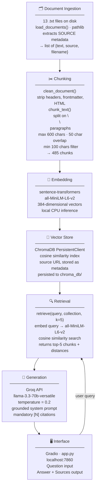

# Project 1 Planning: The Unofficial Guide

> Write this document before you write any pipeline code.
> Your spec and architecture diagram are what you'll use to direct AI tools (Claude, Copilot, etc.) to generate your implementation — the more specific they are, the more useful the generated code will be.
> Update the Retrieval Approach and Chunking Strategy sections if you change your approach during implementation.
> Update this file before starting any stretch features.

---

## Domain

CS student experiences and career advice shared publicly on Hacker News and dev.to — covering imposter syndrome, navigating difficult courses, internship hunting, open-source contribution, and transitioning from school to industry. This knowledge is hard to find through official channels because university career centers and department websites offer generic guidance, while honest, firsthand student experiences — including failures, self-doubt, and what actually worked — are scattered across community forums and personal blogs.

---

## Documents

<!-- List your specific sources: URLs, subreddit names, forum threads, or file descriptions.
     Aim for at least 10 sources that together cover different subtopics or perspectives within your domain. -->

| # | Source | Description | URL or location |
|---|--------|-------------|-----------------|
| 1 | Hacker News | Ask HN: Maybe I'm just not smart enough? (104 pts) — imposter syndrome, interview failures, community encouragement | https://news.ycombinator.com/item?id=26902219 |
| 2 | Hacker News | Ask HN: Is it possible for someone to not be cut out for software engineering? (183 pts, 186 comments) — aptitude doubts, persistence | https://news.ycombinator.com/item?id=12516611 |
| 3 | Hacker News | Ask HN: How did you become a software engineer? (58 pts, 61 comments) — diverse paths from student to professional | https://news.ycombinator.com/item?id=28457499 |
| 4 | Hacker News | Ask HN: Advice for a frustrated CS student (12 pts) — burnout, motivation, staying on track | https://news.ycombinator.com/item?id=6008850 |
| 5 | Hacker News | Ask HN: What advice do you have for new CS students? (7 pts) — first-year tips from practitioners | https://news.ycombinator.com/item?id=36664044 |
| 6 | Hacker News | Ask HN: Advice for taking difficult CS programming courses? — OS course strategies, study habits | https://news.ycombinator.com/item?id=2749231 |
| 7 | Hacker News | Ask HN: Career advice after graduating undergrad — first job search, navigating the job market | https://news.ycombinator.com/item?id=45131312 |
| 8 | Hacker News | Ask HN: International student in Canada struggling to find a CS internship — resume feedback, internship search | https://news.ycombinator.com/item?id=37374626 |
| 9 | Hacker News | Ask HN: Thoughts on grad school? (CS PhD) — whether grad school is worth it, alternatives | https://news.ycombinator.com/item?id=244100 |
| 10 | dev.to | I'm a 21-Year-Old Student Who Shipped 7 AI Apps and 7 Open Source Libraries — project-building strategy | https://dev.to/iamadhitya/im-a-21-year-old-student-who-shipped-7-ai-apps-and-7-open-source-libraries-heres-the-strategy-3cpi |
| 11 | dev.to | From AI/ML Student to GenAI Engineer: My 6-Month Learning Plan for 2026 — career transition roadmap | https://dev.to/procoder_45/from-aiml-student-to-genai-engineer-my-6-month-learning-plan-for-2026-298e |
| 12 | dev.to | GSoC 2026 Week 1 — What Happens When a Student Clicks "Open Assignment"? — open-source contribution experience | https://dev.to/magic-peach/gsoc-2026-week-1-what-happens-when-a-student-clicks-open-assignment-1jk4 |
| 13 | dev.to | Why You Should Build an Online Presence as a Developer — personal branding for students | https://dev.to/kislay/why-you-should-build-an-online-presence-as-a-developer-3j95 |

---

## Chunking Strategy

**Chunk size:** 600 characters maximum (~120 tokens), with a minimum of 100 characters.

**Overlap:** 50 characters between adjacent chunks.

**Reasoning:**

The corpus has two document types that share the same natural semantic unit: the paragraph or individual comment. HN threads are structured as a question body followed by a list of comments, each formatted as `[username]: text`. A single comment is typically 100–500 characters and represents one complete piece of advice. dev.to articles are broken into paragraphs of 50–150 words under markdown headers.

A 600-character max captures the large majority of HN comments without splitting mid-thought. Splitting at paragraph boundaries (`\n\n`) is the primary strategy; the 600-character limit handles the rare comment that runs long by forcing a split at the nearest sentence boundary within that window. A minimum of 100 characters filters out the header lines (TITLE, AUTHOR, SOURCE) and the `--- COMMENTS ---` separator, which would otherwise appear as meaningless chunks in the vector store.

The 50-character overlap is intentionally small because most chunks in this corpus are self-contained units of advice. Large overlap (e.g., 200 characters) would waste embedding space with repeated text and is more useful for documents like legal briefs where context accumulates across paragraphs. Here, a small overlap only guards against the edge case where a key sentence falls exactly at the end of one chunk and continues into the next.

A fixed 200-character split would routinely sever HN comments mid-sentence, breaking the semantic unit and making individual chunks too short to carry enough meaning for the embedding model to represent them accurately. A fixed 1000-character split would merge multiple unrelated comments into a single chunk, making retrieval imprecise — a query about grad school might return a chunk that mentions it briefly inside a longer comment about something else.

---

## Retrieval Approach

**Embedding model:** `all-MiniLM-L6-v2` via `sentence-transformers`.

**Top-k:** 5 chunks per query.

**Production tradeoff reflection:**

`all-MiniLM-L6-v2` produces 384-dimensional embeddings with a 256-token input limit. Our chunks average around 80–100 tokens, so they fit comfortably. The model runs locally on CPU in under 50ms per chunk, requires no API key, and has strong general English performance — good enough for this domain of conversational advice text.

For a production system I would weigh the following tradeoffs:

**Accuracy vs. cost:** OpenAI `text-embedding-3-small` consistently outperforms MiniLM on retrieval benchmarks and supports up to 8191 tokens per input, which would allow embedding entire short documents rather than chunks. The tradeoff is API cost (~$0.02 per million tokens) and network latency on every embed call. For a high-traffic system this adds up; for a low-traffic internal tool it is probably worth the accuracy gain.

**Model size vs. quality:** `all-mpnet-base-v2` is a step up in quality from MiniLM with 768-dimensional embeddings, still runs locally, but is roughly twice the disk footprint and slower on CPU. If latency is not a constraint and the system is running on a machine with a GPU, this would be a straightforward upgrade.

**Multilingual support:** This corpus is entirely English. If the system served students whose forum posts are in other languages, `multilingual-e5-base` or `LaBSE` would be necessary. Both degrade slightly on English versus a monolingual model but handle 100+ languages.

**Domain specificity:** The documents are informal conversational English — not legal, biomedical, or code-heavy. A general model handles this well. If the corpus were, say, academic CS papers, a fine-tuned model like `specter2` would retrieve more precisely on technical terminology.

**Top-k reasoning:** Five chunks at ~120 tokens each yields roughly 600 tokens of retrieved context — enough for the LLM to synthesize a coherent multi-perspective answer without overwhelming the prompt. Setting k=2 risks missing a perspective that only appears in one document; setting k=10 introduces a high probability of off-topic chunks that confuse generation.

---

## Evaluation Plan

| # | Question | Expected answer |
|---|----------|-----------------|
| 1 | What do people suggest to CS students who feel they are not smart enough to succeed in the field? | Response should mention: separating interview performance from general intelligence; practicing interview-style questions specifically rather than treating failure as evidence of low ability; the possibility that concentration or memory issues could be ADHD worth evaluating by a doctor; and that persistence and volume of practice matter more than raw aptitude. Sourced from the "not smart enough" and "not cut out for software engineering" threads. |
| 2 | What advice do people give for surviving a difficult Operating Systems course at university? | Response should mention: becoming proficient in C and understanding pointers before the course starts; taking on the challenge rather than avoiding it; not worrying excessively about grades since the skills built matter more; and that understanding the material is more important than the number of preparatory courses taken. Sourced from the "difficult CS programming courses" thread. |
| 3 | Do experienced engineers say a CS PhD is required to work in AI or machine learning? | Response should state that a PhD is practically required for certain pure research roles and is very helpful for taking on a scientist role immediately, but is not required for most industry AI engineering positions. It should also note that strong industry experience or an MS can be sufficient for many AI engineering roles. Sourced from the grad school thread (the lbrandy comment explicitly addresses this). |
| 4 | What do people recommend for CS students who lose motivation and can't finish side projects? | Response should include: the Ira Glass "taste gap" observation that creative people get frustrated because their taste exceeds their current skill and the fix is producing a high volume of work; and the advice that getting a job with smart people forces you to complete large projects under external accountability, which builds the habits that make solo projects possible. Sourced from the "frustrated CS student" thread. |
| 5 | How do students and developers recommend building a visible portfolio and online presence while still in school? | Response should include: building a personal website you own rather than relying entirely on GitHub or LinkedIn; writing about your projects to explain your thought process (this demonstrates expertise, not just code); shipping projects publicly rather than only announcing them; and extracting reusable code into open-source libraries to create public proof-of-work artifacts. Sourced from the online presence article and the student AI apps article. |

---

## Anticipated Challenges

1. **Decontextualized comment chunks.** Many HN comments reference earlier replies in the same thread: "as the person above mentioned," "building on what X said," or simply "I agree — and also..." When these comments are chunked individually and retrieved, the reference becomes dangling. The LLM sees advice that assumes context it does not have, which can produce a confused or incomplete response. This is hard to fix at the chunking stage without including the parent comment in every child chunk, which would inflate chunk size unpredictably. The mitigation is to filter out very short chunks (under 100 characters) that are pure reactions with no standalone content.

2. **Semantic bleed across thematically similar documents.** Several documents cover overlapping territory — imposter syndrome, feeling frustrated, not being cut out for SE, and advice for new students all involve similar vocabulary and emotional framing. A query about one topic will almost certainly pull chunks from all of them rather than routing cleanly to the most relevant document. This makes source attribution less precise and risks diluting a focused answer with tangentially related content. The mitigation at retrieval time is keeping top-k low (5 rather than 10) so that the most similar chunks win, and at generation time writing a system prompt that instructs the model to synthesize across sources rather than treat any single chunk as canonical.

---

## Architecture

---

## AI Tool Plan

**Milestone 3 — Ingestion and chunking:**

I will give Claude the Chunking Strategy section of this planning.md plus the raw text of `hn_advice_frustrated_cs_student.txt` as a concrete example. I will ask it to implement two functions: `load_documents(directory: str) -> list[dict]`, which reads every `.txt` file and extracts the `SOURCE:` line as metadata; and `chunk_text(text: str, max_size: int = 600, overlap: int = 50, min_size: int = 100) -> list[str]`, which splits on `\n\n` paragraph boundaries and enforces the max/min size constraints. I will verify the output by running both functions against all 13 documents and checking that (a) the total chunk count falls between 200 and 600, (b) no chunk contains a raw `TITLE:` or `SOURCE:` line, and (c) no chunk is shorter than 100 characters.

**Milestone 4 — Embedding and retrieval:**

I will give Claude the Retrieval Approach section, the output format of `load_documents()` (a list of dicts with `text` and `source` keys), and the ChromaDB Python client API. I will ask it to implement `build_vector_store(chunks: list[dict]) -> chromadb.Collection`, which embeds each chunk using `all-MiniLM-L6-v2` and upserts it into ChromaDB with the source URL stored as metadata; and `retrieve(query: str, collection, k: int = 5) -> list[dict]`, which embeds the query and returns the top-k chunks with their source URLs. I will verify by manually running three of the five evaluation questions against the built store and checking that the retrieved chunks are topically relevant (not just keyword matches) and that every returned item includes a populated `source` field.

**Milestone 5 — Generation and interface:**

I will give Claude the project requirements for grounded generation and source attribution, the retrieve function signature, and a draft system prompt. I will ask it to implement the full query function that calls `retrieve()`, formats the chunks as numbered context blocks, and calls the Groq API with a system prompt that (a) instructs the model to answer only from the provided context, (b) requires citing the source URL for each claim, and (c) instructs it to reply "I don't have information on that in my documents" if no relevant chunks were retrieved. I will also ask it to build a Gradio interface with a text input and a response area that shows the answer and the list of retrieved sources. I will verify by running all five evaluation questions through the UI and confirming every response includes at least one source URL, then testing one out-of-domain question (e.g., "What is the capital of France?") to confirm the system refuses rather than hallucinates.
